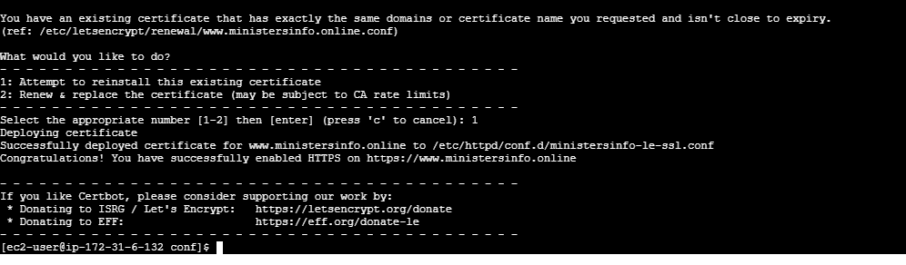
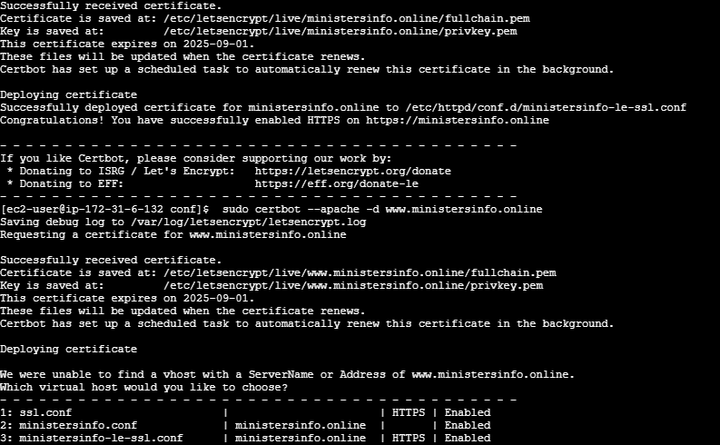
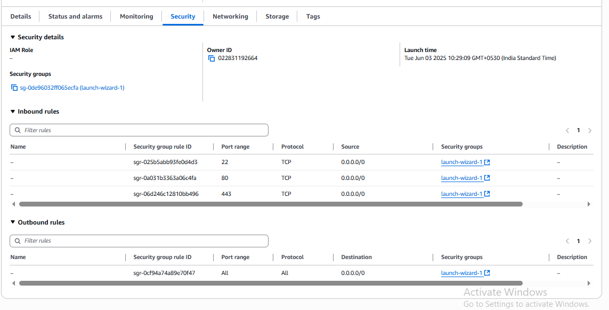

# 🔒 Securing a Web Server with Let's Encrypt SSL on AWS EC2

This repository documents the process of provisioning and configuring a **free SSL/TLS certificate** from **Let's Encrypt** on an Apache web server running on an **AWS EC2 instance**. The entire process is automated using the **Certbot** client, transforming an insecure HTTP site into a secure HTTPS site.

---
## 🛠️ Core Technologies

-   **Cloud Provider:** Amazon Web Services (AWS EC2)
-   **Web Server:** Apache2
-   **Certificate Authority:** Let's Encrypt
-   **Automation Client:** Certbot
-   **Operating System:** Ubuntu Linux

---
## ✨ Visual Walkthrough: Before & After

This showcase demonstrates the transformation of the website from an insecure, unencrypted connection to a fully secured, HTTPS-enabled site.

### **1. The Initial State: Insecure Website**
Initially, the website is served over HTTP, and browsers correctly flag it as "Not Secure."


### **2. Running the Certbot Client**
The Certbot client is an interactive tool that automates the process of obtaining and installing the SSL certificate. It prompts for the domain name to secure.



### **3. Successful Certificate Deployment**
Upon successful completion, Certbot confirms that the certificate has been deployed and the server configuration has been updated to redirect HTTP traffic to HTTPS.



### **4. The Final Result: Secure HTTPS Site**
The website is now accessible over HTTPS, with a valid certificate. Browsers show the lock icon, indicating a secure, encrypted connection.



---
## ⚙️ How to Replicate This Setup

### **1. Prerequisites**
-   An AWS EC2 instance (Ubuntu is recommended).
-   A registered domain name pointed to your EC2 instance's public IP address.
-   Your EC2 security group must allow inbound traffic on port **80 (HTTP)** and port **443 (HTTPS)**.

### **2. Connect to Your EC2 Instance**
```bash
ssh -i "your-key.pem" ubuntu@your-ec2-public-ip
```

### **3. Install Apache and Certbot**
First, install the Apache web server. Then, install Certbot using `snap` for the most up-to-date version.
```bash
# Update package lists
sudo apt update

# Install Apache2
sudo apt install apache2 -y

# Install snapd
sudo apt install snapd -y

# Install Certbot via snap
sudo snap install --classic certbot
sudo ln -s /snap/bin/certbot /usr/bin/certbot
```

### **4. Obtain and Install the SSL Certificate**
Run the Certbot client with the Apache plugin. It will automatically detect your domain from your Apache configuration, obtain the certificate, and configure Apache for you.
```bash
sudo certbot --apache
```
Follow the interactive prompts to enter your email and agree to the terms. When asked, choose the option to redirect all HTTP traffic to HTTPS.

### **5. Verify Automatic Renewal**
Certbot automatically sets up a cron job or systemd timer to renew your certificate before it expires. You can test the renewal process with a dry run.
```bash
sudo certbot renew --dry-run
```
If the dry run is successful, your auto-renewal is set up correctly.

---
## 👨‍💻 Author

**Aryan Sharma**
-   **B.Tech CSE (AI & DS)** | Poornima University
-   **Location:** Jaipur, Rajasthan, India
-   **GitHub:** [@AryanSharma2206](https://github.com/AryanSharma2206)
-   **LinkedIn:** [linkedin.com/in/aryan-sharma-a2a240353](https://www.linkedin.com/in/aryan-sharma-a2a240353)
